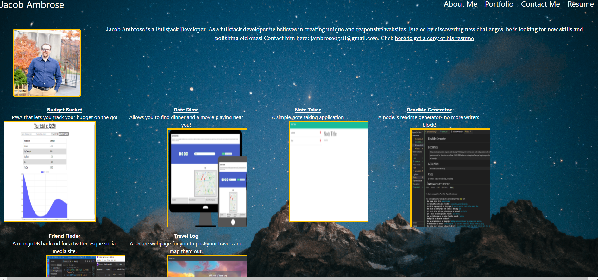

# My React Portfolio

## DESCRIPTION

> To create a professional portfolio that can showcase my skills using React.js
> and utilizing my ability to learn new technologies quickly and efficiently
> This will also conveniently double as a portion of my professional portfolio.

## INSTALLATION

> none

## USAGE

none

## LANGUAGES & TECHNOLOGIES

> JavaScript,HTML,CSS,ES6 and React.js, Tailwinds CSS

## AUTHOR(S)

>

- [Jacob Ambrose](https://www.github.com/jambrose0)
  >

## LICENSE

## PREVIEW

> 
